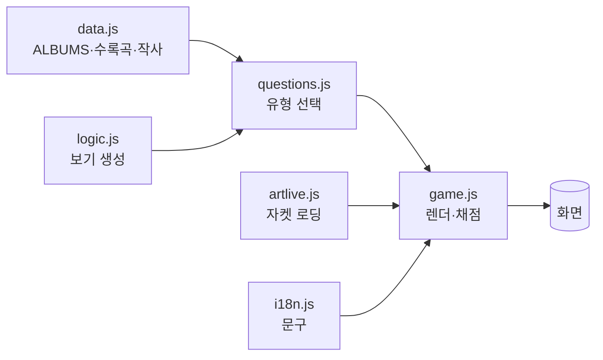

<div align="center">

# 🎴 SEVENTEEN 앨범 자켓 퀴즈

**앨범 자켓을 보고 앨범 · 발매연도 · 타이틀곡 · 수록곡 · 작사가 · 유닛곡을 맞히는 웹 퀴즈**

설치·빌드 불필요 · 순수 HTML/CSS/JS · 라이트/다크 · 데일리 챌린지 · 결과 공유 카드

### ▶ **[지금 바로 플레이하기](https://alfira0526.github.io/seventeen-photocard-test/)**

<sub>https://alfira0526.github.io/seventeen-photocard-test/ · 폰·PC 어디서나</sub>

<sub>Vanilla JS · 의존성 0 · 단위 19 + E2E 4 테스트 · 웹서치 검증 데이터</sub>

</div>

---

## 📸 미리보기

| 시작 화면 | 플레이 (고난도 문제) |
|---|---|
|  |  |

| 결과 화면 | 공유 카드 (트위터용) |
|---|---|
|  |  |

> 스크린샷의 자켓 자리는 **오프라인 플레이스홀더**입니다. 온라인에서 열면 그 자리에
> 실제 앨범 커버가 자동으로 로드됩니다(아래 [자켓 이미지](#-앨범-자켓-이미지-자동) 참고).

---

## 🎮 바로 해보기

정적 사이트라 아무 방법으로나 실행됩니다.

```bash
# 방법 1) 로컬 서버
python3 -m http.server 8000        # → http://localhost:8000
# 또는
npm run serve

# 방법 2) 파일을 브라우저로 바로 열기
#   index.html 더블클릭 (일부 브라우저는 로컬 파일 제약이 있어 방법 1 권장)
```

### 🌐 라이브 데모

**→ https://alfira0526.github.io/seventeen-photocard-test/**

### GitHub Pages로 배포 (무설치, 초보자용)

1. 저장소 **Settings → Pages** 이동
2. **Build and deployment → Source: “Deploy from a branch”**
3. 브랜치를 이 프로젝트 브랜치로, 폴더는 **`/ (root)`** 로 지정 후 **Save**
4. 1~2분 뒤 `https://alfira0526.github.io/seventeen-photocard-test/` 로 접속

---

## 🕹️ 게임 규칙

- 자켓 1장당 **랜덤 유형 1문제**, 4지선다
- 한 판 = **10장**, 문제당 10점 (만점 **100점**)
- 정답률에 따라 **캐럿 등급**: 👀 관심 → 🌱 입덕 준비생 → 💎 진성 캐럿 → 🏆 캐럿 마스터

### 문제 유형

그 앨범에 **데이터가 있을 때만** 고난도 유형이 출제됩니다(정확도 우선).

| 유형 | 질문 | 필요 데이터 | 난이도 |
|---|---|---|---|
| `album` | 이 자켓의 앨범은? | 기본 | ★ |
| `year` | 발매 연도는? | 기본 | ★ |
| `titleTrack` | 타이틀곡은? | 기본 | ★★ |
| `notInAlbum` | 이 앨범의 수록곡이 **아닌** 것은? | 수록곡 | ★★★ |
| `lyricist` | 타이틀곡 작사에 참여한 멤버는? | 작사 멤버 | ★★★ |
| `unitSong` | 특정 유닛이 부른 곡은? | 수록곡 + 유닛 태그 | ★★★★ |

- **근접 오답**: 같은 시기·같은 유형 앨범, 가까운 연도를 오답으로 섞어 찍기를 어렵게 합니다.

### 모드

| 모드 | 설명 |
|---|---|
| 🎲 **일반** | 랜덤 10장 |
| 📅 **데일리 챌린지** | 날짜 시드 기반 — 하루 종일 같은 문제(결정론적) + 연속 참여 🔥스트릭 |

기타: 🌙/☀️ **라이트·다크 테마**(선택 저장) · 🖼️ **결과 공유 카드**(PNG 저장 / 트위터 공유)

---

## 🖼️ 앨범 자켓 이미지 (자동)

이미지 파일은 **저작권상 리포에 담지 않습니다.** 자켓은 **iTunes(Apple) CDN에서 실시간으로**
불러옵니다 — 설치·명령 없이 페이지를 열면 자동 표시됩니다(`js/artlive.js`, JSONP).

우선순위: `js/albumArt.js`(사전 베이크) → **실시간 로딩** → SVG 플레이스홀더(오프라인/차단 시)

- **온라인이면 자동으로 자켓이 뜹니다** (권장, 무설치).
- (선택) 안정성/오프라인용으로 URL을 미리 고정하려면: `npm run fetch-art`
  → `js/albumArt.js`에 URL을 베이크(이미지 파일이 아니라 URL만 저장).

> **왜 파일을 안 담나요?** 자켓도 저작권물이라 **재배포**가 쟁점입니다. 공식 CDN에서
> 식별 목적으로 로드하면 리포에 저작물을 담지 않으면서 출처·화질도 안정적입니다.

---

## 🧩 프로젝트 구조

```
index.html            # 화면(시작/플레이/결과) + 테마 부트 스크립트
css/style.css         # 라이트·다크 테마 · 모션 · 반응형
js/
  i18n.js             # UI 문자열 중앙화(i18n-lite)         ┐ 브라우저 & Node 공용
  logic.js            # 순수 로직(셔플·보기 생성·근접 오답) │ (테스트 대상)
  questions.js        # 문제 유형 레지스트리(가용성+가중랜덤) ┘
  data.js             # 정답 소스: ALBUMS(+수록곡/유닛/작사) + 무결성 검증
  artlive.js          # 자켓 실시간 로딩(iTunes JSONP) 폴백
  game.js             # 게임 엔진: 모드·라운드·채점·결과·공유·테마 (DOM 전담)
  albumArt.js         # (선택·자동생성) 자켓 CDN URL — fetch-art.mjs 산출물
scripts/fetch-art.mjs # iTunes 아트워크 수집기(+수동 오버라이드 맵)
tests/
  quiz.test.mjs       # 순수 로직·문제 엔진·데이터 무결성 단위 테스트
  e2e.test.mjs        # Playwright E2E (모드·완주·공유·트위터)
docs/                 # 설명 문서 + 스크린샷
```

자세한 설계·데이터 흐름은 **[docs/ARCHITECTURE.md](docs/ARCHITECTURE.md)**,
데이터 추가 방법은 **[docs/DATA_GUIDE.md](docs/DATA_GUIDE.md)** 참고.

### 데이터 흐름 (한눈에)



---

## 🧪 테스트

```bash
npm test           # 유닛 + 문제엔진 + 데이터 무결성 (19 tests, 브라우저 불필요)
npm run test:e2e   # 브라우저 E2E (Playwright 필요; 없으면 자동 skip)
npm run test:all   # 전체
```

특수 환경 브라우저 경로 지정: `SVT_CHROMIUM_PATH=/path/to/chromium npm run test:e2e`

---

## ✅ 데이터 정확도

- 정규/미니 20개 + 스페셜·유닛·믹스테이프·디지털 싱글 7개 = **총 27개**(모두 웹서치 검증).
  앨범/연도/타이틀곡 3라운드 교차검증 로그는 [ANALYSIS.md](ANALYSIS.md).
- 수록곡·유닛곡·작사 멤버: 곡별 크레딧을 웹으로 확인해 **검증된 앨범만** 반영(정확도 우선).
  커버리지 확대 방법은 [docs/DATA_GUIDE.md](docs/DATA_GUIDE.md).

문서 목록: [ARCHITECTURE](docs/ARCHITECTURE.md) · [DATA_GUIDE](docs/DATA_GUIDE.md) ·
[CHANGELOG](CHANGELOG.md) · [ANALYSIS(개선분석)](ANALYSIS.md) · [PROGRESS(작업로그)](PROGRESS.md)

---

## 📜 면책

**팬메이드 비영리 데모**입니다. 앨범 자켓 등 이미지의 저작권은 각 저작권자(플레디스 등)에게
있으며, 식별 목적으로 Apple Music CDN에서 로드합니다. 곡·앨범·멤버 정보는 공개 자료를
바탕으로 하며 오류가 있을 수 있습니다(제보 환영).
