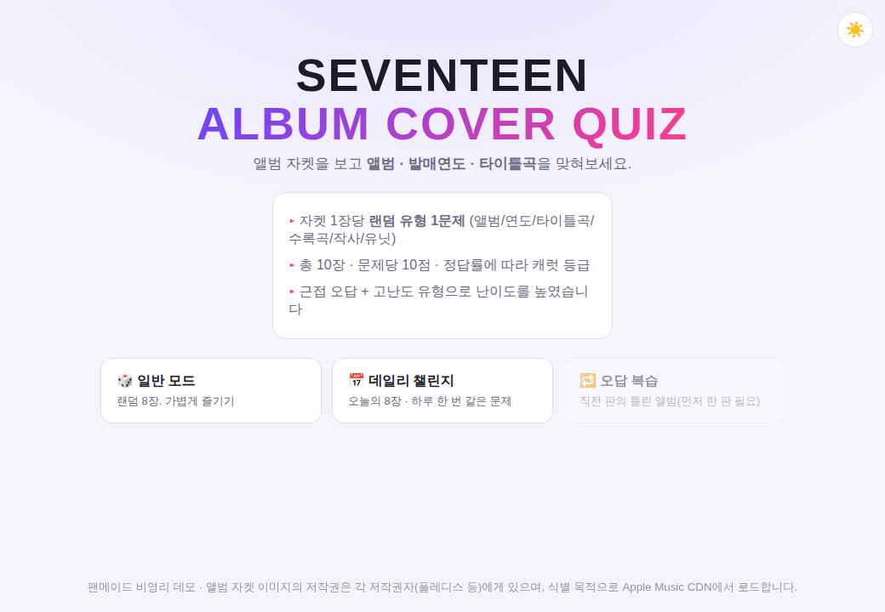
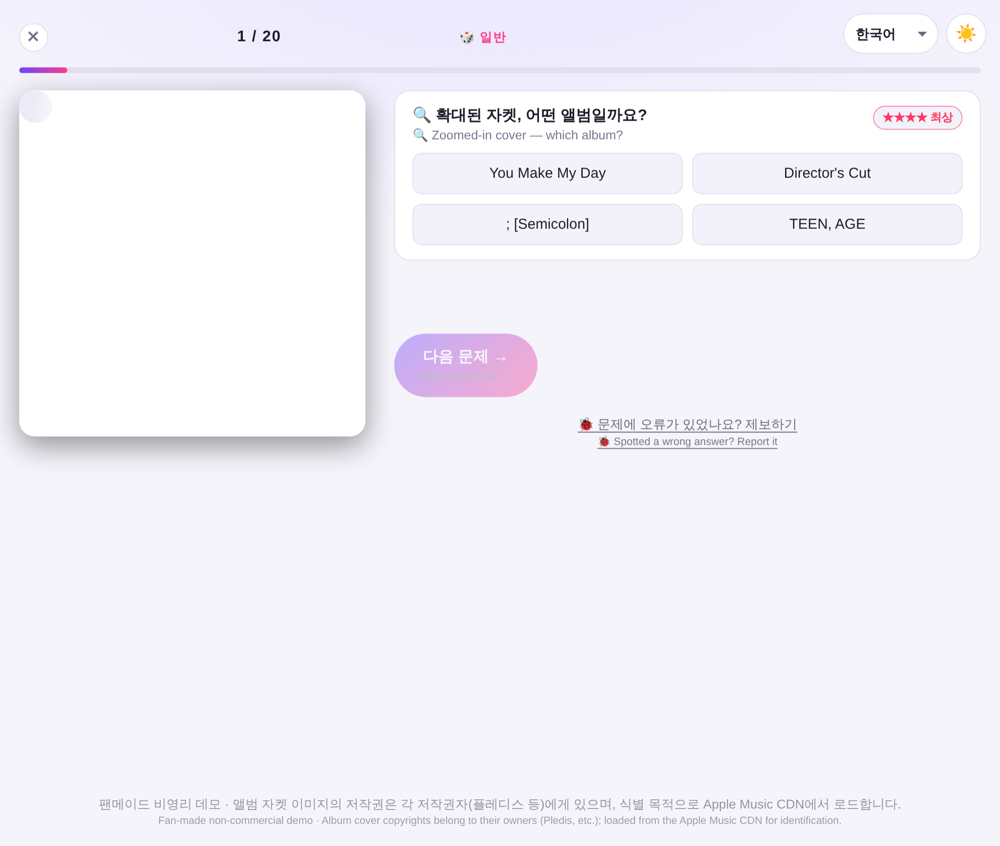
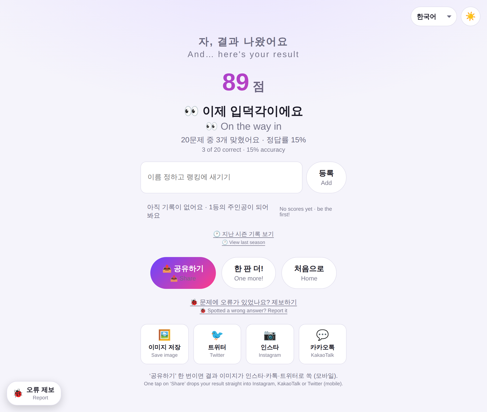
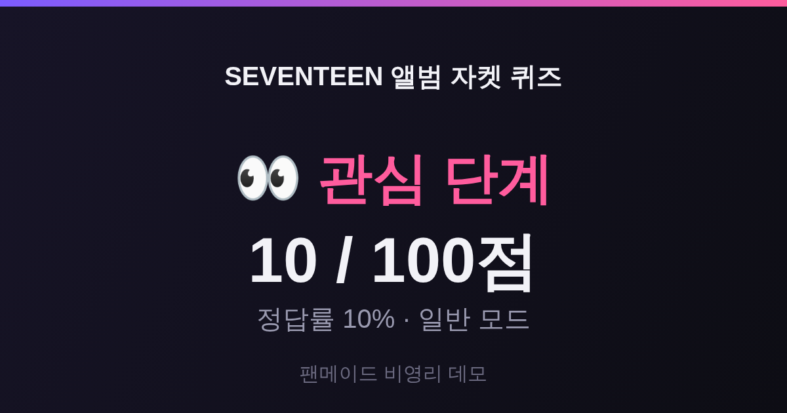
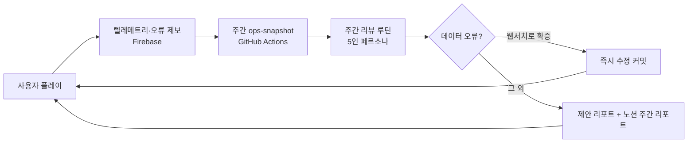
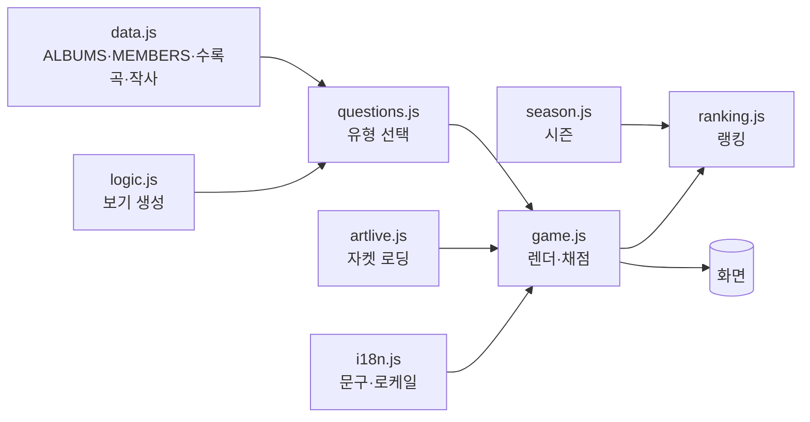

<div align="center">

# 🎴 SEVENTEEN 앨범 자켓 퀴즈

**앨범 자켓을 보고 앨범 · 발매연도 · 타이틀곡 · 수록곡 · 작사가 · 유닛곡 · 멤버를 맞히는 웹 퀴즈**

설치·빌드 불필요 · 순수 HTML/CSS/JS · 라이트/다크 · 7개 언어 · 월간 시즌 랭킹 · 결과 공유 카드

### ▶ **[지금 바로 플레이하기](https://alfira0526.github.io/seventeen-photocard-test/)**

<sub>https://alfira0526.github.io/seventeen-photocard-test/ · 폰·PC 어디서나</sub>

### 🧪 **[테스트베드(미리보기)](https://alfira0526.github.io/seventeen-photocard-test/preview/)**

<sub>다음 업데이트를 미리 검수하는 공간 · 실제 랭킹과 분리(데이터 격리) · 상단에 빨간 배너 표시</sub>

<sub>Vanilla JS · 의존성 0 · 단위 38 + E2E 테스트 · 문제 유형 18종 · 7개 로케일 · 웹서치 교차검증 데이터</sub>

</div>

---

## 📸 미리보기

| 시작 화면 | 플레이 (고난도 문제) |
|---|---|
|  |  |

| 결과 화면 | 공유 카드 (트위터용) |
|---|---|
|  |  |

> 스크린샷의 자켓 자리는 **오프라인 플레이스홀더**입니다. 온라인에서 열면 그 자리에
> 실제 앨범 커버가 자동으로 로드됩니다(아래 [자켓 이미지](#-앨범-자켓-이미지-자동) 참고).

---

## 🎮 바로 해보기

정적 사이트라 아무 방법으로나 실행됩니다.

```bash
# 방법 1) 로컬 서버
python3 -m http.server 8000        # → http://localhost:8000
# 또는
npm run serve

# 방법 2) 파일을 브라우저로 바로 열기
#   index.html 더블클릭 (일부 브라우저는 로컬 파일 제약이 있어 방법 1 권장)
```

### 🌐 라이브 데모

**→ https://alfira0526.github.io/seventeen-photocard-test/**

### GitHub Pages로 배포 (무설치, 초보자용)

1. 저장소 **Settings → Pages** 이동
2. **Build and deployment → Source: “Deploy from a branch”**
3. 브랜치를 이 프로젝트 브랜치로, 폴더는 **`/ (root)`** 로 지정 후 **Save**
4. 1~2분 뒤 `https://alfira0526.github.io/seventeen-photocard-test/` 로 접속

---

## 🕹️ 게임 규칙

- 자켓 1장당 **랜덤 유형 1문제**, 4지선다
- 한 판 = **20장**(무한·타임어택 제외)
- **점수 변별**: 문제 난이도(1~4)에 따라 기본 배점(10·14·20·28) + **속도 보너스**(≤7초, 최대 +12) +
  **콤보 배수**(연속 정답마다 ×0.1↑, 최대 ×1.9). 지식은 캐럿 등급, 속도·콤보는 순위로 역할 분리.
- 정답률에 따라 **캐럿 등급**: 👀 관심 → 🌱 입덕 준비생 → 💎 진성 캐럿 → 🏆 캐럿 마스터
- 오답 시 **트리비아 해설**로 배경지식 한 줄 제공

### 문제 유형 (18종)

그 앨범/멤버에 **데이터가 있을 때만** 고난도 유형이 출제됩니다(정확도 우선 · 가용성 게이팅 + 가중 랜덤).

| 그룹 | 유형 | 질문 요지 | 난이도 |
|---|---|---|---|
| 앨범 기본 | `album` · `year` | 이 자켓의 앨범은? / 발매 연도는? | ★ |
| 앨범 심화 | `titleTrack` · `albumType` · `albumNumber` | 타이틀곡 / 앨범 유형 · 집수 | ★★ |
| 자켓/시간 | `albumCrop` · `timeline` · `laterAlbum` | 자켓 크롭(확대) 맞히기 / 발매연도 순 정렬 | ★★★ |
| 수록곡 | `notInAlbum` · `unitSong` · `lyricist` | 수록곡이 **아닌** 것 / 유닛곡 / 작사 참여 멤버 | ★★★ |
| 멤버 | `memberUnit` · `memberUnitSong` · `memberNotSong` · `memberRoster` · `memberLyricist` | 멤버-유닛·곡·작사 매칭 | ★★★★ |
| 유튜브 솔로 | `ytSong` · `ytYear` | 유튜브 솔로곡 / 그 발매 연도 | ★★★ |

- **근접 오답**: 같은 시기·같은 유형 앨범, 가까운 연도를 오답으로 섞어 찍기를 어렵게 합니다.
- **자켓 번호 노출 방지**: 자켓에 "Nth MINI ALBUM"이 인쇄돼 정답이 노출되는 경우 해당 유형은 기본 미출제.

### 모드

| 모드 | 설명 |
|---|---|
| 🎲 **일반** | 랜덤 20장 + **난이도 선택**(쉬움 ×0.8 · 보통 ×1.0 · 어려움 ×1.3, 랭킹은 통합·배수로 공정) |
| 📅 **데일리 챌린지** | 날짜 시드 기반 — 하루 종일 같은 문제(결정론적) + 연속 참여 🔥스트릭 |
| ♾️ **무한** | 틀릴 때까지 계속 |
| ⏱️ **타임어택** | 제한 시간 내 최대 득점 |
| 🔁 **오답 복습** | 이전에 틀린 문제만 다시 |

기타: 🌙/☀️ **라이트·다크 테마**(선택 저장) · 🖼️ **결과 공유 카드**(PNG 저장 / 트위터 공유) ·
🌐 **7개 언어**(한국어·日本語·English·中文·Español·ไทย·Português, 접속 지역 자동 감지 + 수동 전환) · ⚙️ **설정 패널**(언어·테마·영문 병기 on/off)

---

## 🏆 시즌 & 명예의 전당

- **월간 시즌**: 매월 1일 리셋 / 말일 종료. **챔피언 = 지난 달 1위**를 왕관으로 영구 박제.
- **2026-07 = 오픈베타**: 그 시즌 1위는 **'시즌 첫 챔피언'** 특별 타이틀로 금색 박제.
- **명예의 전당**: 일반·무한·타임어택 3모드를 한 화면에 나란히(세로 롤링) + **[이번 달]/[분기 누적]** 탭 +
  실시간 15초 주기 갱신.
- **시즌 라이프사이클**: 종료 D-N 카운트다운 배너(막판 D-3 빨간 펄스로 순위 경쟁 유도), 자동 롤오버.
- 전역 랭킹은 **Firebase**에 저장(교차 기기). 셋업은 [docs/RANKING_SETUP.md](docs/RANKING_SETUP.md) ·
  시즌 데이터 구조는 [docs/SEASON_DATA.md](docs/SEASON_DATA.md).

---

## 🖼️ 앨범 자켓 이미지 (자동)

이미지 파일은 **저작권상 리포에 담지 않습니다.** 자켓은 **iTunes(Apple) CDN에서 실시간으로**
불러옵니다 — 설치·명령 없이 페이지를 열면 자동 표시됩니다(`js/artlive.js`, JSONP).

우선순위: `js/albumArt.js`(사전 베이크) → **실시간 로딩** → SVG 플레이스홀더(오프라인/차단 시)

- **자동 베이크(권장):** GitHub Actions **[Bake album cover URLs](.github/workflows/fetch-art.yml)**
  워크플로가 GitHub 서버에서 커버 URL을 뽑아 `js/albumArt.js`로 커밋합니다.
  → 배포 사이트는 런타임 API에 의존하지 않아 안정적(오매칭·레이트리밋 없음).
  실행: 저장소 **Actions 탭 → "Bake album cover URLs" → Run workflow** (또는 데이터 변경 push 시 자동).
- 로컬에서 직접: `npm run fetch-art`
- 오매칭 앨범은 `scripts/fetch-art.mjs`의 **수동 오버라이드 맵**에 정확한 collectionId를 넣어 교정
  (예: Love&Letter 원반 vs 리패키지반).
- `albumArt.js`에 없는 앨범만 런타임 로딩(엄격 매칭)으로 폴백, 실패 시 플레이스홀더.

> **왜 파일을 안 담나요?** 자켓도 저작권물이라 **재배포**가 쟁점입니다. 공식 CDN에서
> 식별 목적으로 로드하면 리포에 저작물을 담지 않으면서 출처·화질도 안정적입니다.

---

## 📊 운영 루프 (텔레메트리 · 제보 · 주간 리뷰)

라이브 운영을 데이터로 돌리는 자동화 루프를 갖추고 있습니다.



- **텔레메트리**(`analytics.js`): 모드 이용률 + 유형/개별 문제 정답률을 **익명** 집계(개인정보 없음).
- **오류 제보**(`report.js` + 🐞 버튼): 현재 문제 맥락을 자동 첨부해 수집.
- **주간 스냅샷**(GitHub Actions): Firebase → `docs/ops/`. **이상탐지**(유형 평균 대비 이탈폭)로 데이터 오류 후보 자동 표시.
- **주간 리뷰**: 5인 페르소나가 이용률·정답률·제보를 검토 → 웹 교차검증으로 확증된 오류는 즉시 수정,
  그 외는 제안. 리포트는 `docs/reports/`에 누적. 프로세스: [docs/OPS_ROUTINES.md](docs/OPS_ROUTINES.md).
- **신규 문제 검수 파이프라인**: `draft` 태그 → 테스트베드 전용 검수 모드 → CI 게이트로 통과분만 반영.
  가이드: [docs/QUESTION_REVIEW.md](docs/QUESTION_REVIEW.md).

---

## 🧩 프로젝트 구조

```
index.html            # 화면(시작/플레이/결과) + 테마 부트 스크립트
css/style.css         # 라이트·다크 테마 · 모션 · 반응형
js/
  i18n.js             # UI 문자열 중앙화 · 7개 로케일           ┐ 브라우저 & Node 공용
  logic.js            # 순수 로직(셔플·보기 생성·근접 오답)      │ (테스트 대상)
  questions.js        # 문제 유형 레지스트리(18종·가용성+가중랜덤) ┘
  data.js             # 정답 소스: ALBUMS·MEMBERS(+수록곡/유닛/작사/YT) + 무결성 검증
  geo.js              # 접속 지역 → 로케일 자동 감지
  artlive.js          # 자켓 실시간 로딩(iTunes JSONP) 폴백
  coverMeta.js        # 자켓 번호 노출 여부 등 커버 메타
  memberPhotos.js     # 멤버별 사진 바리에이션(최대 5종)
  game.js             # 게임 엔진: 모드·라운드·채점·결과·공유·테마 (DOM 전담)
  season.js           # 월간 시즌 스케줄·롤오버·챔피언 라벨
  ranking.js          # 전역 랭킹(Firebase) 등록·조회
  ranking-config.js   # 랭킹/백엔드 설정
  analytics.js        # 익명 텔레메트리(모드·정답률)
  report.js           # 오류 제보 수집(모달)
  announce.js         # 업데이트 공지 모달(버전당 1회)
  env.js              # 런타임 환경/키
  albumArt.js         # (선택·자동생성) 자켓 CDN URL — fetch-art.mjs 산출물
scripts/fetch-art.mjs # iTunes 아트워크 수집기(+수동 오버라이드 맵)
tests/
  quiz.test.mjs       # 순수 로직·문제 엔진·시즌·데이터 무결성 단위 테스트
  e2e.test.mjs        # Playwright E2E (모드·완주·공유·트위터)
docs/                 # 설명 문서 + 스크린샷 + 운영 스냅샷/리포트
```

자세한 설계·데이터 흐름은 **[docs/ARCHITECTURE.md](docs/ARCHITECTURE.md)**,
데이터 추가 방법은 **[docs/DATA_GUIDE.md](docs/DATA_GUIDE.md)** 참고.

### 데이터 흐름 (한눈에)



---

## 🧪 테스트

```bash
npm test           # 유닛 + 문제엔진 + 시즌 + 데이터 무결성 (38 tests, 브라우저 불필요)
npm run test:e2e   # 브라우저 E2E (Playwright 필요; 없으면 자동 skip)
npm run test:all   # 전체
```

특수 환경 브라우저 경로 지정: `SVT_CHROMIUM_PATH=/path/to/chromium npm run test:e2e`

---

## ✅ 데이터 정확도

- 정규·미니·스페셜·유닛·리패키지·믹스테이프·디지털/일본 싱글 = **앨범 29개**(모두 웹서치 검증) +
  **멤버 13인** + **유튜브 솔로곡**. 앨범/연도/타이틀곡 3라운드 교차검증 로그는 [ANALYSIS.md](ANALYSIS.md).
- 수록곡·유닛곡·작사 멤버: 곡별 크레딧을 웹으로 확인해 **검증된 앨범만** 반영(정확도 우선).
  커버리지 확대 방법은 [docs/DATA_GUIDE.md](docs/DATA_GUIDE.md).
- 라이브 데이터로 상시 점검: 정답률이 유형 평균을 크게 하회하는 문제는 **이상탐지 → 주간 리뷰**에서
  웹 교차검증 후 수정(예: Face the Sun 타이틀곡=HOT, Love&Letter 원반 자켓 교정).

문서 목록: [ARCHITECTURE](docs/ARCHITECTURE.md) · [DATA_GUIDE](docs/DATA_GUIDE.md) ·
[ROADMAP](docs/ROADMAP.md) · [OPS_ROUTINES](docs/OPS_ROUTINES.md) · [RANKING_SETUP](docs/RANKING_SETUP.md) ·
[SEASON_DATA](docs/SEASON_DATA.md) · [QUESTION_REVIEW](docs/QUESTION_REVIEW.md) · [RELEASE](docs/RELEASE.md) ·
[CHANGELOG](CHANGELOG.md) · [ANALYSIS(개선분석)](ANALYSIS.md) · [PROGRESS(작업로그)](PROGRESS.md)

---

## 📜 면책

**팬메이드 비영리 데모**입니다. 앨범 자켓 등 이미지의 저작권은 각 저작권자(플레디스 등)에게
있으며, 식별 목적으로 Apple Music CDN에서 로드합니다. 곡·앨범·멤버 정보는 공개 자료를
바탕으로 하며 오류가 있을 수 있습니다(제보 환영).
